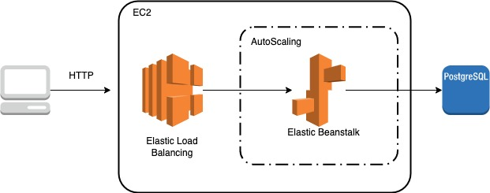
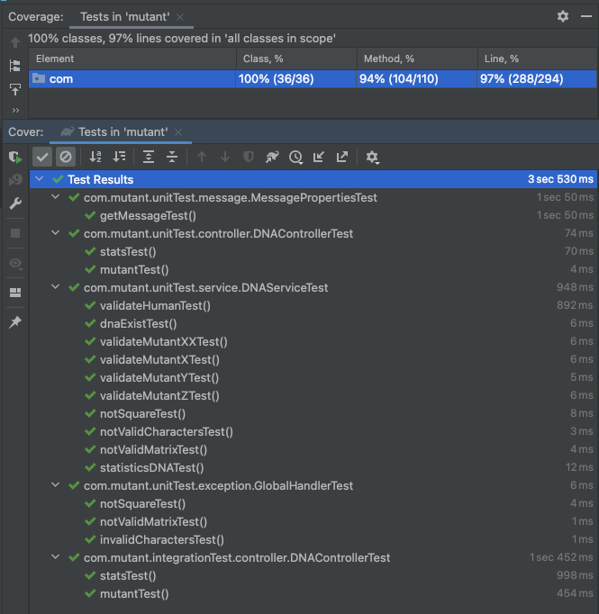

# <p style='color:#5285c5'>**Mutant Solution**</p>

- This application manages to detect if someone is a mutant or human through DNA analysis.
- It allows to observe the statistics and comparison of the analyzes that it has executed.

## <p style='color:#5285c5'>**Implementation**</p>

The API is developed with a microservices architecture with the following technologies.

- **Java 11**
- **Spring Boot**
- **JPA**
- **JUnit**
- **Mockito**
- **OpenApi**

In this case there are 1 microservice responsible for performing DNA analysis and statistics.

In the microservice you can find different packages, which have the *com.mutants* convention. Listed below are those that can be found.

- **common** : Contains classes that facilitate behavior and utility management .
- **common.exception** : Contains the classes that facilitate the handling of exceptions.
- **common.message** : Contains the classes that facilitate the handling of messages.
- **common.util** : Contains the class that provided usefulness.
- **controller** : Contains the class where the requests arrive and from where they are delegated.
- **entity** : Contains the class that represent a DB table and columns.
- **model** : Contains the domain objects that receive and respond to requests.
- **repository** : Contains the class in charge of managing the persistence operations with a database table.
- **service** : Contains the interfaces and implementation of business valitations.

## <p style='color:#5285c5'>**Cloud Architecture**</p>

In this project, technologies from the AWS cloud will be implemented, such as those detailed below.

- **Elastic Beanstalk** : It is a PaaS service from Amazon Web Services.
- **RDS** : Relational Database Service. In this case PostgreSQL was selected.
- **PostgreSQL** : Relational database management system.



## <p style='color:#5285c5'>**Use**</p>

To use the application you only have to work on the following end points.

- *http://mutant.eba-suawgfd3.eu-west-1.elasticbeanstalk.com/mutant*
- *http://mutant.eba-suawgfd3.eu-west-1.elasticbeanstalk.com/stats*

## <p style='color:#5285c5'>**Details**</p>

- *RequestDTO* : When consuming the endpoint *http://mutant.eba-suawgfd3.eu-west-1.elasticbeanstalk.com/mutant/* a RequestDto must be sent. 

Example:

```json
{
  "dna" : ["ACAC","TGAA","GTCC","AACT"]
}
```


- *ResponseDTO* : The endpoints respond in the following way.

Example:

```json
{
  "status": "403 FORBIDDEN",
  "errors": "Without errors",
  "details": "Is a human",
  "objects": {
    "dna": "{\"dna\":[\"ACAC\",\"TGAA\",\"GTCC\",\"AACT\"]}",
    "type": "HUMAN"
  }
}
```

Note: In order to facilitate the use of the application, the *MAGNETO-POSTMANCOLLECTION.postman_collection.json* file has been attached.

To see more details click on the following link. This will take you to the documentation on SwaggerUI.

*http://mutant.eba-suawgfd3.eu-west-1.elasticbeanstalk.com/swagger-ui/index.html#/dna-controller/mutant*

## <p style='color:#5285c5'>**Test**</p>

The unit tests are located in the *src\test\java\com\mutant* folder.

